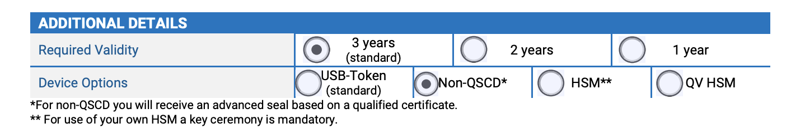

# Getting eSEAL eIDAS certificate in NL from Quo-Vadis

> Note: this process was followed by us and may differ when you apply. Always check with your CA on the latest process.

Make sure that you have already found the right issuer of your certificate from the trusted list

The form to apply for right certificates can be found here:

[https://www.quovadisglobal.com/nl-en/documents/]

Choose:
**Application form QuoVadis (EU) Qualified eSeal certificate**

Depending on your internal application architecture and security requirements you must ask for your digital certifcate in appropriate form. If you do use specific security instruments like HSMs or valuts or if you are not sure about it please ask for a digital certificate file. 

**For asking digital certificate file make sure to select "Non-QCSD" option so that you recive digital certificate file.**

 

If you selected Non-QSCD option, you will be asked to provide a CSR file, kindly follow the process mentioned below:

You can generate a CSR using following guide
[Refer to CSR guide here:](../CSR.md)
